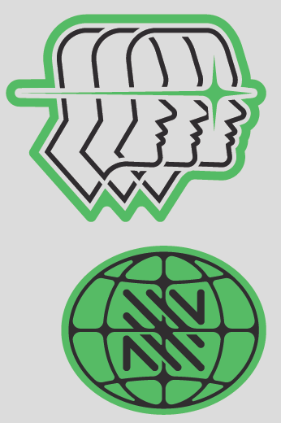

Getting Started
===============

A high-level Python client for the `NOSIBLE Search
API <https://www.nosible.ai/search/v1/docs/swagger#/>`__. Easily
integrate the Nosible Search API into your Python projects.

📦 Installation
~~~~~~~~~~~~~~~

.. code:: bash

   pip install nosible

⚡ Installing with uv 
~~~~~~~~~~~~~~~~~~~~~

.. code:: bash

    uv pip install nosible

**Requirements**:

- Python 3.9+
- polars
- duckdb
- openai
- tantivy
- pyrate-limiter
- tenacity
- cryptography
- pyarrow
- pandas

🔑 Authentication
~~~~~~~~~~~~~~~~~

1. Sign in to NOSIBLE.AI and grab your free API key.
2. Set it as an environment variable or pass directly:

On Windows

.. code:: powershell

   $Env:NOSIBLE_API_KEY="basic|abcd1234..."
   $Env:LLM_API_KEY="sk-..."  # for query expansions (optional)

On Linux

.. code:: bash

   export NOSIBLE_API_KEY="basic|abcd1234..."
   export LLM_API_KEY="sk-..."  # for query expansions (optional)

Or in code:

- As an argument:

.. code:: python

   from nosible import Nosible

   client = Nosible(
       nosible_api_key="basic|abcd1234...",
       llm_api_key="sk-...",
   )

- As an environment variable:

.. code:: python

   from nosible import Nosible
   import os

   os.environ["NOSIBLE_API_KEY"] = "basic|abcd1234..."
   os.environ["LLM_API_KEY"] = "sk-..."

🔍 Your first search
~~~~~~~~~~~~~~~~~~~~

.. code:: python
    from nosible import Nosible

    with Nosible(nosible_api_key="YOUR API KEY") as client:

        results = client.fast_search(
            question="What is Artificial General Intelligence?"
        )

        print(results)

--------------

📡 Swagger Docs
~~~~~~~~~~~~~~~

You can find online endpoints to the NOSIBLE Search API Swagger Docs
`here <https://www.nosible.ai/search/v1/docs/swagger#/>`__.

--------------

.. toctree::
   :maxdepth: 4
   :caption: User Guide
   :hidden:

   configuration
   examples
   rate_limits

API reference
-------------

.. autosummary::
   :toctree: api
   :caption: API Reference

   nosible.Nosible
   nosible.Result
   nosible.ResultSet
   nosible.Search
   nosible.SearchSet
   nosible.WebPageData
   nosible.Snippet
   nosible.SnippetSet